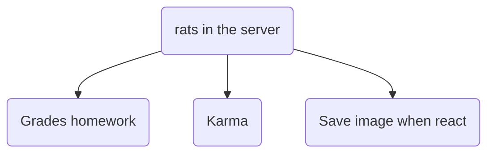

# Python homework
## Yippee!! Welcome to my little python mini project
### Functionality:
There are currently two functions: grades homework and karma. Both are incoorporated into a discord bot.\
Grades homework stores the input grades in discord into a json file and is able to produce selected outputs.\
Karma stores discord user karma and is able to increase or decrease the karma when there is a + or - in a message with a tagged member.\
Save image if reacted saves a copy of the image if it is reacted to to /images\
\
:) its so work in progress that the code is wild af\
no discord api keys to be had here

